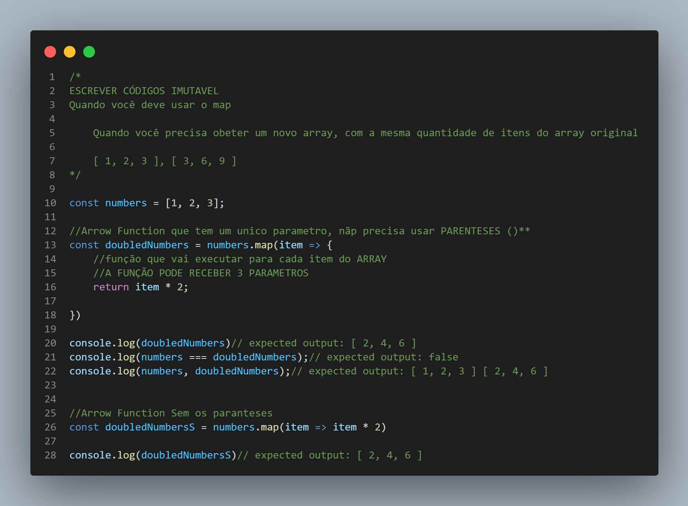

#  Quando devo usar o método map()?

Quando você precisa obeter um novo array, com a mesma quantidade de itens do array original.

exemplo: Array Original [ 1, 2, 3 ] e quero um novo Array que me retorne os valores multiplicado por 2.

Então o Novo Array vai ser [ 3, 6, 9 ]. A mesma quantidade de itens do Array Original, porém multiplicado por 2.

O método map() invoca a função callback passada por argumento para cada elemento do Array e devolve um novo Array como resultado.

O método map() chama a função callback recebida por parâmetro para cada elemento do Array original, em ordem, e constrói um novo array com base nos retornos de cada chamada.

A função callback é chamada com três argumentos: o valor do elemento corrente, o índice do elemento corrente e o array original que está sendo percorrido.


## Exercício do método map();
```
/*
  Exercício
  - Gere um novo array com cada um dos números abaixo elevados ao quadrado e 
    exiba o novo array no console.
  
  Dica: pesquise por exponentiation operator (**).
*/

const numbers = [5, 7, 3, 2, 10, 52, 81, 9]
```

## 
<p align="center">

</p>


<h1 align="center">💻 Desenvolvido Por: Gilberto Júnior</h1>